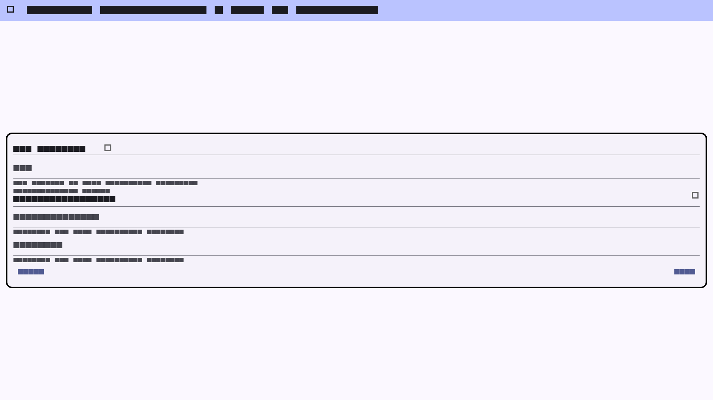

# send_to_linkwarden

Android app for sending links to Linkwarden

## Authentication

The app now supports both API key and username/password authentication. When
adding a Linkwarden instance you can choose your preferred method. If you use
username and password, the app will create a temporary session token just like
the official browser extension.

The link form now fetches a small portion of the target page to display a
preview image and pre-fill the title and description when available.



### Regenerating Screenshots

To regenerate the screenshot for the README, you can run the following script:

```bash
./scripts/generate_screenshots.sh
```

## License

This project is licensed under the GNU General Public License v3.0 - see the [LICENSE](LICENSE) file for details.
